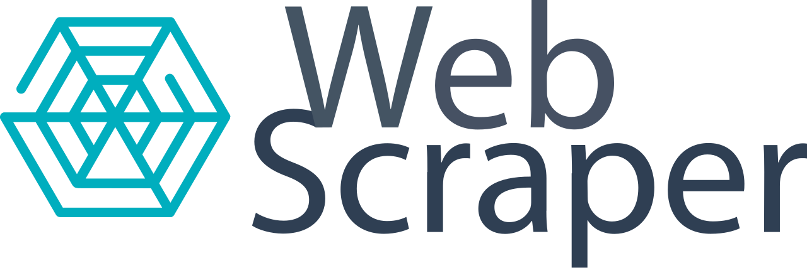

# 🏚️ Web Scrapper imobiliárias

---

## 🏗️ Sobre 

Projeto desenvolvido de forma independente com o objetivo de implementar web scrapers para extração automatizada de dados de sites de imobiliárias. A aplicação coleta informações relevantes sobre imóveis disponíveis para venda, estruturando os dados e armazenando-os tanto em uma planilha no Google Sheets quanto em um banco de dados relacional SQL, possibilitando posterior análise e processamento dos dados.

Foram implementados quatro scrapers, cada um adaptado às particularidades estruturais de diferentes plataformas imobiliárias:

- [Ivo Imóveis](https://www.ivoimoveis.com/)
- [Sp House](https://sphouseimoveis.com/)
- [Quinto andar](https://www.quintoandar.com.br/)
- [Lello imóveis](https://www.lelloimoveis.com.br/)

Cada scraper foi desenvolvido considerando as diferenças na estrutura HTML, organização das informações e dinâmica de carregamento das páginas de cada site. Dessa forma, foram aplicadas estratégias específicas de extração para cada fonte.

Durante o desenvolvimento, algumas decisões de implementação priorizaram eficiência e tempo de execução em detrimento da extração completa de determinados campos. Essa abordagem permitiu otimizar o processo de coleta de dados, reduzindo significativamente o tempo de scraping, ainda que algumas informações menos críticas não fossem capturadas em todos os casos.

---

## 🔨 Tecnologias Utilizadas

**Linguagem:**

* Python 3.9+

**Bibliotecas principais:**

* `requests` – realização de requisições HTTP para acesso às páginas web
* `BeautifulSoup` – parsing e extração de informações do HTML das páginas
* `SQLAlchemy` – interação e persistência de dados em banco de dados relacional SQL
* `gspread` – integração e envio de dados para planilhas do Google Sheets
* `oauth2client` – autenticação e autorização para acesso à API do Google Sheets
* `python-dotenv` – gerenciamento de variáveis de ambiente (credenciais e configurações)
* `json` – manipulação de dados no formato JSON

**Ambiente de desenvolvimento:**

* `venv` – criação e gerenciamento de ambiente virtual para isolamento de dependências
  

